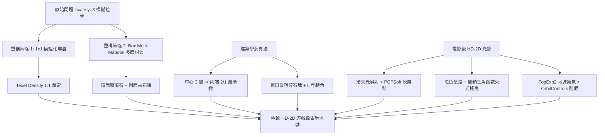

# 【3D Web 遊戲開發實戰】徹底告別醜陋方塊！打造本格派 HD-2D 古堡地城圍牆與電影級光影

> **系列簡介**：本篇專欄將手把手拆解如何將 Three.js 中生硬、拉伸且毫無生氣的「垂直方塊牆壁」，一步步重組成具備《歧路旅人（八方旅人）》、《三角戰略》質感的高階 **HD-2D 像素古堡遺跡**。適合用於技術部落格、鐵人賽或 GameDev 開發日誌分享。

---

## 目錄導覽

1. [前言與問題診斷：為什麼原本的牆壁那麼醜？](#一前言與問題診斷為什麼原本的牆壁那麼醜)
2. [Step 1：像素藝術核心法則——貼圖濾鏡與 Texel Density 對齊](#step-1像素藝術核心法則貼圖濾鏡與-texel-density-對齊)
3. [Step 2：解決拉伸難題——Box 多材質陣列（Multi-Material）與 1x1 模組化堆疊](#step-2解決拉伸難題box-多材質陣列multi-material與-1x1-模組化堆疊)
4. [Step 3：建築學演算法——殘破古堡遺跡的「高低起伏與斷裂層次」](#step-3建築學演算法殘破古堡遺跡的高低起伏與斷裂層次)
5. [Step 4：電影級 HD-2D 光影系統——冷暖對比明暗法與動態軟陰影](#step-4電影級-hd-2d-光影系統冷暖對比明暗法與動態軟陰影)
6. [Step 5：靈魂點睛之筆——鍛鐵壁燈與物理燭火搖曳效果（Flicker FX）](#step-5靈魂點睛之筆鍛鐵壁燈與物理燭火搖曳效果flicker-fx)
7. [Step 6：手感與視角——平滑阻尼 OrbitControls 與視角防穿幫](#step-6手感與視角平滑阻尼-orbitcontrols-與視角防穿幫)
8. [前後成果對比總結與技術複盤](#七前後成果對比總結與技術複盤)

---

## 一、前言與問題診斷：為什麼原本的牆壁那麼醜？

在嘗試製作 2.5D / HD-2D 風格的地城遊戲時，許多初學者在 Day 10+ 階段常會寫出這樣的程式碼：

```javascript
// ❌ 原版寫法：遇到牆壁直接沿 Y 軸放大 3 倍
if (tileType === 5) {
  tile.scale.y = 3;
  tile.position.y = 3 / 2;
}
```

這樣的寫法會帶來致命的四大視覺災難：

1. **材質嚴重垂直拉伸（Aspect Ratio 扭曲 300%）**：
   - 原本地面是 16×16 的正方形像素點，一旦將 1x1x1 的方塊 `scale.y = 3`，側面貼圖會被硬生生縱向拉長 3 倍。像素顆粒變成了垂直細長條，像素藝術（Pixel Art）的精神蕩然無存。
2. **拿地板貼圖充當牆壁**：
   - 牆壁直接套用地板的鵝卵石圖片（`stone1.png`）。在真實遊戲中，**牆頂（Coping Stone）**、**牆身立面（Brick Masonry）** 和 **地板（Pavement）** 的材質紋理是完全不同的。
3. **零陰影、平面死光**：
   - 場景只有一盞無方向的 `AmbientLight`，沒有直射光，沒有陰影貼圖（Shadow Map）。方塊立面與地板交界處沒有接觸陰影（Ambient Occlusion），看起來就像懸浮或貼在螢幕上的貼紙。
4. **缺乏建築美學的「積木直條」**：
   - 固定高度 3 的單調直線隨機散落，缺乏古城堡歷經風化、戰爭崩塌的「殘垣斷壁感」。

接下來，我們分步驟一步步解決這些問題！

---

## Step 1：像素藝術核心法則——貼圖濾鏡與 Texel Density 對齊

在 3D 引擎裡渲染 Pixel Art，最忌諱的就是模糊。Three.js 預設會開啟雙線性插值（LinearFilter）與 Mipmaps，這會讓像素邊緣糊成一片。

### 核心修改：像素銳利化載入器
我們封裝一個專門載入像素貼圖的函式：

```javascript
const textureLoader = new THREE.TextureLoader();

function loadPixelTexture(url) {
  const tex = textureLoader.load(url);
  // 關鍵：將放大與縮小濾鏡強制設為 NearestFilter (最近鄰插值)
  tex.magFilter = THREE.NearestFilter;
  tex.minFilter = THREE.NearestFilter;
  // 關閉 Mipmaps，避免遠距離時被引擎自動模糊化
  tex.generateMipmaps = false;
  return tex;
}
```

### 抽離地城專屬材質
我們從遊戲圖庫中提取出彼此和諧匹配的專屬貼圖：
- `wall_face.png`：暗藍灰古堡磚牆立面（與地板藍黑鵝卵石色系呼應）。
- `wall_face_moss.png`：生長青苔的風化石磚（作為隨機變體）。
- `wall_top.png`：帶有深色雕刻邊框的平整壓頂石（專門用於牆頂）。
- `wall_top_cracked.png`：碎裂風化的壓頂石板。
- `lantern.png`：復古鍛鐵壁燈。

---

## Step 2：解決拉伸難題——Box 多材質陣列（Multi-Material）與 1x1 模組化堆疊

### 1. 什麼是 Box 多材質陣列？
Three.js 的 `BoxGeometry` 允許我們傳入一個包含 **6 個材質** 的陣列，分別對應六個面：

```
材質陣列順序：[+X (右), -X (左), +Y (頂), -Y (底), +Z (前), -Z (後)]
```

因此，只要把頂面（索引 2）指定為壓頂石，其餘側面指定為石磚立面，就能做出「上面平整、側面砌磚」的精緻牆磚！

```javascript
// 頂層方塊專用：頂面是壓頂石，四面是石磚
const wallCapMaterials = [
  wallFaceMat, // +X 右
  wallFaceMat, // -X 左
  wallTopMat,  // +Y 頂面 (壓頂石板)
  wallFaceMat, // -Y 底面
  wallFaceMat, // +Z 前面
  wallFaceMat  // -Z 後面
];
```

### 2. 徹底摒棄 `scale.y = 3`，改用「1x1 模組化垂直堆疊」
為了保證牆面每一格高度的像素大小與地面 16px 完全 1:1 鎖定（Texel Density 一致）：
- **高度為 3 的牆壁**：由 3 個 1×1×1 的方塊垂直堆疊而成（Y 軸位置分別在 `0.5`, `1.5`, `2.5`）。
- **底層與中層**：四周套用石磚或青苔磚。
- **最頂層**：套用 `wallCapMaterials` 帶有壓頂石。

```javascript
// 遍歷所有被標記為牆壁 (代碼 5) 的格子
for (let layer = 0; layer < height; layer++) {
  const isTop = (layer === height - 1);
  let blockMat;

  if (isTop) {
    // 頂層方塊：套用壓頂石多材質
    const isMossy = Math.random() < 0.25;
    blockMat = isMossy ? wallCapMossMaterials : wallCapMaterials;
  } else {
    // 中下層方塊：套用石磚或 30% 機率青苔磚
    blockMat = (layer === 0 && Math.random() < 0.3) ? wallMossMat : wallFaceMat;
  }

  const block = new THREE.Mesh(tileGeo, blockMat);
  // 垂直位置精準堆疊：y = layer + 0.5
  block.position.set(posX, layer + 0.5, posZ);
  block.castShadow = true;
  block.receiveShadow = true;
  scene.add(block);
}
```

> **成果收穫**：每一塊磚頭的長寬比完全是正方形，像素顆粒感扎實飽滿，徹底告別拉伸！

---

## Step 3：建築學演算法——殘破古堡遺跡的「高低起伏與斷裂層次」

現實中的廢墟不會是整整齊齊的 3 格高方塊。我們要賦予城牆「崩塌感」：

### 1. 斷垣高度漸變演算法
一段長度為 $L$ 的牆壁：
- **中心主體**：完整度高，高度為 3。
- **兩端斷口**：崩塌至 2 或 1 格高。
- **邊緣掉落碎石**：牆體斷口附近，有 45% 機率在地板上散落代碼為 `2` 的障礙碎石。

```javascript
// 計算殘破牆壁的高低漸變
let height = 3;
if (k === 0 || k === seg.len - 1) {
  // 最外端：倒塌成 1 或 2 層
  height = Math.random() < 0.5 ? 1 : 2;
} else if (k === 1 || k === seg.len - 2) {
  // 次外端：過渡為 2 或 3 層
  height = Math.random() < 0.7 ? 2 : 3;
}

// 斷口處掉落碎石
if ((k === 0 || k === seg.len - 1) && Math.random() < 0.45) {
  // 在鄰近位置生成凸起的散落碎石塊 (tileType = 2)
}
```

### 2. L 型拐角防禦工事
在城牆末端加入 90 度轉角，讓城牆看起來像曾經是一間密室或堡壘的角落，大幅提升空間立體感。

---

## Step 4：電影級 HD-2D 光影系統——冷暖對比明暗法與動態軟陰影

HD-2D 畫面之所以驚艷，秘訣在於**「冷色陰影」與「暖色點光源」形成的強烈冷暖對比（Chiaroscuro）**。

### 1. 開啟 WebGL 軟陰影
```javascript
renderer.shadowMap.enabled = true;
renderer.shadowMap.type = THREE.PCFSoftShadowMap; // 柔和邊緣陰影
renderer.toneMapping = THREE.ACESFilmicToneMapping; // 電影級色調映射
renderer.toneMappingExposure = 1.15;
```

### 2. 地下城燈光三重奏
1. **深藍紫環境底光（AmbientLight）**：
   - 顏色 `#121528`，強度 1.8。提供地下城深邃幽暗的基底，避免背光面死黑。
2. **天頂月光斜射（DirectionalLight + castShadow）**：
   - 顏色 `#a2b7ed`（微冷淡藍），強度 2.8。從 `(22, 36, 18)` 斜射而下，牆體會在地面與其他牆面上投下長條斜影。
3. **天地半球光（HemisphereLight）**：
   - 天空色 `#252b48`，地面反射色 `#0c0d16`，使物體仰角與俯角的光影過渡極為自然。

### 3. 指數地城迷霧（FogExp2）
```javascript
// 讓遠處的地城自然沒入深黑色迷霧中
scene.background = new THREE.Color('#080912');
scene.fog = new THREE.FogExp2('#080912', 0.022);
```

---

## Step 5：靈魂點睛之筆——鍛鐵壁燈與物理燭火搖曳效果（Flicker FX）

沒有光源的石牆是冰冷的，加上壁燈立刻就有了「RPG 冒險」的靈魂！

### 1. 3D 壁燈本體與自發光材質
我們在城牆柱頂安放一個小巧的方塊（`0.35 x 0.45 x 0.35`），並賦予 `emissive` 自發光：

```javascript
const lanternMat = new THREE.MeshStandardMaterial({
  map: lanternTex,
  emissive: new THREE.Color('#ff8822'), // 橘紅色自發光
  emissiveIntensity: 1.6,
  roughness: 0.4
});
```

### 2. 橘黃色溫暖點光源（PointLight）
在壁燈中心掛載 `PointLight('#ff9d3a', 3.8, 9)`，照亮周圍的冷藍色石磚。

### 3. 程序化微風搖曳演算法（Procedural Flicker）
真實火焰的光亮絕不是固定不變的。我們在 `requestAnimationFrame` 迴圈中，利用**不同頻率的正弦與餘弦波疊加**，產生無法預測但極為自然的燭火晃動：

```javascript
function animate() {
  requestAnimationFrame(animate);
  const elapsedTime = clock.getElapsedTime();

  // 每一盞燈擁有各自獨立的速度 (speed) 與相位 (phase)
  animatedLights.forEach(item => {
    const flicker = Math.sin(elapsedTime * item.speed + item.phase) * 0.35 +
                    Math.cos(elapsedTime * item.speed * 2.1 + item.phase) * 0.2;
    item.light.intensity = item.baseIntensity + flicker;
  });

  controls.update();
  renderer.render(scene, camera);
}
```

---

## Step 6：專屬 2.5D 固定俯視角——為「角色移動跟隨」做好架構準備

在真實的 RPG / 地城遊戲中，我們不希望玩家能隨意用滑鼠把鏡頭轉到穿幫，而是需要一個**經典固定傾角的 2.5D 俯視視角**，且鏡頭要隨時能跟隨主角（Player）移動。

### 1. 移除 OrbitControls，定義相機目標與偏移量（Offset）
我們在初始化時定義 `cameraTarget`（注視目標點）與 `cameraOffset`（相機相對目標的固定偏移向量）：

```javascript
// 視角參數：改為經典 HD-2D 平視低仰角 (FOV 26°)，鏡頭放低以看到更多角色正面與牆面立體感
const camera = new THREE.PerspectiveCamera(26, sizes.width / sizes.height, 0.1, 1000);

// 2.5D 固定平俯視角：目標設在角色上半身高度 (y=0.8)，相機高度 Y 壓低至 8.5
// 視角仰角約 28 度，大幅減少由上往下看到頭頂的比例，呈現角色的正面與挺拔立體感，且完全不露虛空
export const cameraTarget = new THREE.Vector3(0, 0.8, 0);
export const cameraOffset = new THREE.Vector3(0, 8.5, 16); // 經典平視 HD-2D 偏移

// 初始定位
camera.position.copy(cameraTarget).add(cameraOffset);
camera.lookAt(cameraTarget);
```

### 2. 在渲染迴圈中鎖定目標
```javascript
function animate() {
  requestAnimationFrame(animate);

  // ... (火光晃動邏輯) ...

  // 保持相機固定鎖定在目標點
  // 🌟 未來加入主角時：只需在玩家移動邏輯中執行 cameraTarget.copy(player.position)
  // 鏡頭就會自動平滑跟隨玩家跑圖！
  camera.position.copy(cameraTarget).add(cameraOffset);
  camera.lookAt(cameraTarget);

  renderer.render(scene, camera);
}
```

> **架構亮點**：完全擺脫了滑鼠誤觸轉動鏡頭的困擾，並且直接為即將到來的「玩家角色與移動控制系統」打下了完美的鏡頭跟隨基礎！

---

## 七、前後成果對比總結與技術複盤

### 核心技術架構複盤



### 總結給讀者的心法：
1. **永遠不要為了偷懶對 Pixel Art 方塊進行非等比 `scale`**：模組化堆疊或是重寫 UV 才是維護像素尊嚴的正道。
2. **頂面與側面分離是 2.5D 的靈魂**：人的視線是俯視的，頂部的「收邊感（壓頂石）」決定了 80% 的模型質感。
3. **冷暖對比成就氛圍**：深藍的孤寂地城與一盞微微搖曳的暖黃壁燈，就是 HD-2D 最能觸動玩家冒險慾望的公式。
